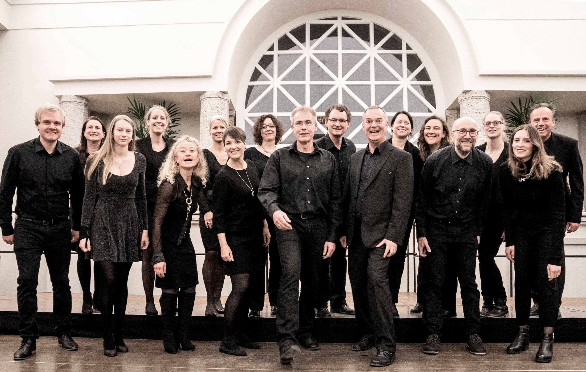

|[Home](index.md)|[Über uns](ueber_uns.md)|[Termine](termine.md)|[Kontakte](kontakte.md)|[Impressum](impressum.md)|

# Der Chor
{:width=200}

Der Art Chor Langsdorf wurde 1977 als Jugendchor der evangelischen Gemeinde in Langsdorf gegründet. Die Umbenennung in ArtChor Langsdorf erfolgte 1998. Mittlerweile kann der Chor auf über 30 Jahre Chorarbeit und ihre Erfolge zurückblicken: Unzählige Konzerte, zahlreiche erlebnisreiche Chorfreizeiten (Kloster Ilbenstadt, Marburg, Mainz) und Teilnahmen an größeren, teils internationalen Chorprojekten (u.a. mit John Vaida, Music Director aus Pennsylvania/USA sowie Alastair Thompson, ehem. Mitglied der King's Singers) ließen das Gemeinschaftsgefüge und den Klangkörper des Chores wachsen. Trotz stetig wechselnder Besetzung der Frauen- und Männerstimmen gelang und gelingt es, mit momentan 19 aktiven Sängerinnen und Sängern anspruchsvolle Chormusik auf die Bühne zu bringen. Mitverantwortlich dafür ist der Chorleiter Thomas Bailly, mit dem der Chor seit 1989 zusammen arbeitet. Außerdem tritt der ArtChor Langsdorf regelmäßig in Gottesdiensten und bei öffentlichen Veranstaltungen auf.

# Der Chorleiter
Thomas Bailly

Der Dirigent und Musikpädagoge leitet seit 1985 Chöre und Vokal-Ensembles sämtlicher Gattungen und verschiedenster Stilrichtungen.

1968 erster Instrumentalunterricht. 1977-1997 Organist in den Kirchengemeinden Wölfersheim, Giessen, Bad Nauheim. Nach dem Abitur Studium der Schulmusik, Kirchenmusik und Physik in Mainz und Frankfurt am Main. 

Interpretationskurse, Meisterkurse und Einstudierung unter Leonard Bernstein, Claudio Abbado, Petr Eben, Eric Ericson, Gabor Hollerung, Kurt Suttner, Volker Hempfling, Alastair Thompson, Morten Lauridsen, Knut Nystedt, Gwyn Arch u.a.

Als mehrfacher 1. Preisträger bedeutender Chorwettbewerbe ist er ein international gefragter Leiter von Workshops, Chorfestivals und Konzertreihen und in zahlreichen Wettbewerben als Juror vertreten.

Seit 1993 im Bundesmusikausschuss tätig und Leiter der Chorleiterlehrgänge des Hessischen Sängerbundes am Dr. Hoch’s Konservatorium Frankfurt. Publikationen in den Bereichen Stimmbildung, chorische Stimmbildung und Chorliteratur.

In Verbindung mit seiner musikpädagogischen Tätigkeit am Sankt-Lioba-Gymnasium Bad Nauheim leitet er neben internationalen Chorprojekten als Künstlerischer Leiter die Deutsch-Amerikanischen Chorfestivals Bad Nauheim (2000, 2002, 2004, 2006, 2007, 2010). Zahlreiche Kooperationsveranstaltungen mit Fachverbänden, Fachverlagen und Kultur-Institutionen.

Künstlerischer Leiter von VOCALISSIMO 2003 – dem Deutsch-Afrikanischen Chorfestival in Kooperation mit der Universität Johannisburg.

Seit 2007 Künstlerischer Leiter der Musik-Sommer-Akademie-Wetterau FESTIVOKAL www.festivokal.de

 In Kooperation mit der Neuen Philharmonie Frankfurt ist er seit 2009 künstlerischer Leiter des OVAG-Projektchores mit chorsinfonischen Konzerten innerhalb des „Klasse-Klassik-Sommers“ Friedberg  (Ludwig van Beethoven – Symphonie Nr. 9, Carl Orff – Carmina Burana).

Homepage Thomas Bailly

# Die Musik
Das Repertoire des ArtChors umfasst mittlerweile über 300 geistliche und weltliche Chorstücke aller Epochen und Stilrichtungen. Von Zeit zu Zeit werden mehrtägige Chorfreizeiten an Wochenenden veranstaltet. Hier können z.B. Konzerte besonders intensiv vorbereitet werden und es bietet sich die Möglichkeit zur ausgiebigen Stimmbildung, teilweise mit ausgewählten Stimmbildnern. Selbstverständlich kommt hierbei der gesellige Teil nicht zu kurz. Diese Freizeiten bieten Neueinsteigern ideale Möglichkeiten, den Chor kennenzulernen.
